# **Pressupost 1 : Ordinador para un arquitecte**

<link rel="stylesheet" href="css/stylesBudget1.css" />

## **1. Tria i pressupost dels elements**

### **1.1 Elements de l'ordinador**
| **IMATGE**                                       |    **ELEMENT**                                                        |    **PREU**  |
|:------------------------------------------------:|:---------------------------------------------------------------------:|--------------|
| 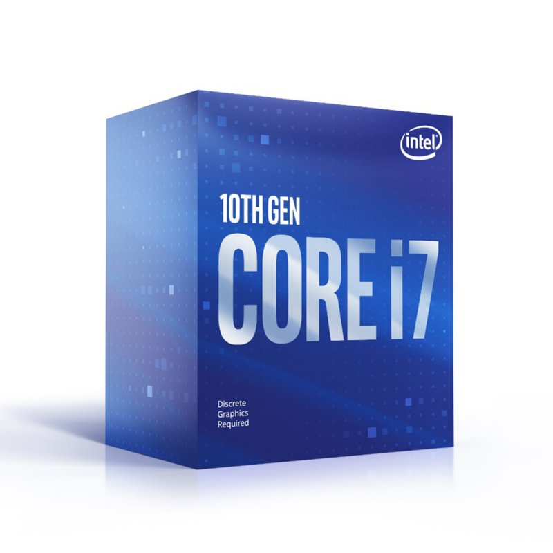                        | Processador [Intel Core i7-10700K 3.80 GHz][i7]                       | 369,90€      |
|         | Placa base [Asus PRIME B365-PLUS][placa]                              | 169,90€      |
| 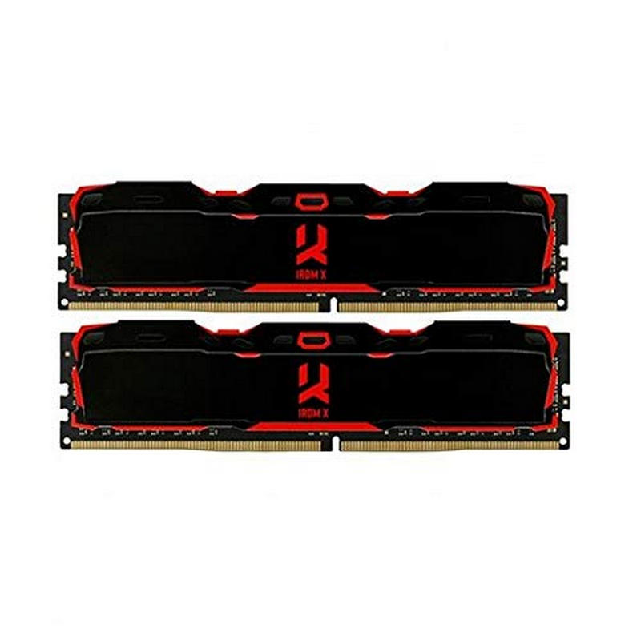              | Memoria Ram [GoodRam IRMD X DDR4 3000MHz 2x8GB CL16][Ram]             |  72,00€      |
| 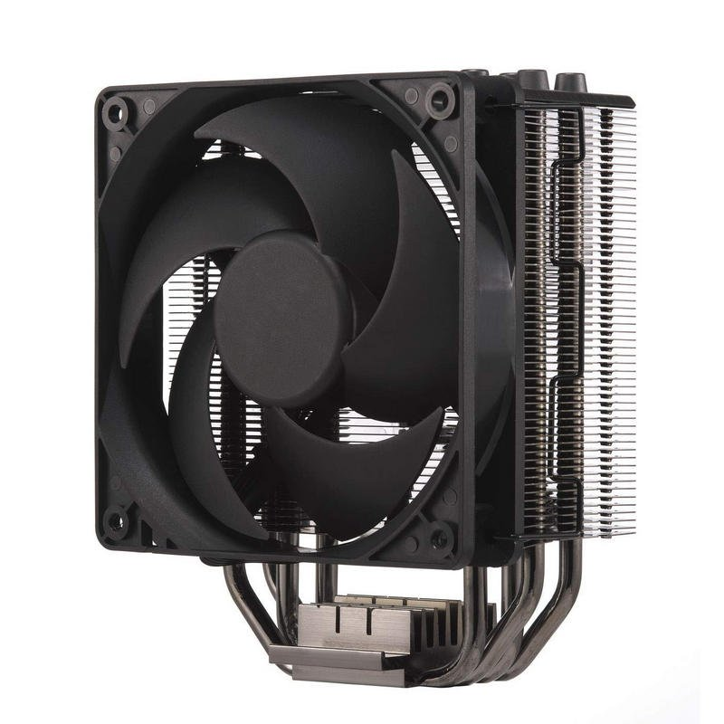 | Ventilador CPU [Cooler Master Hyper 212 Black Edition][cooler]        |  34,98€      |
| 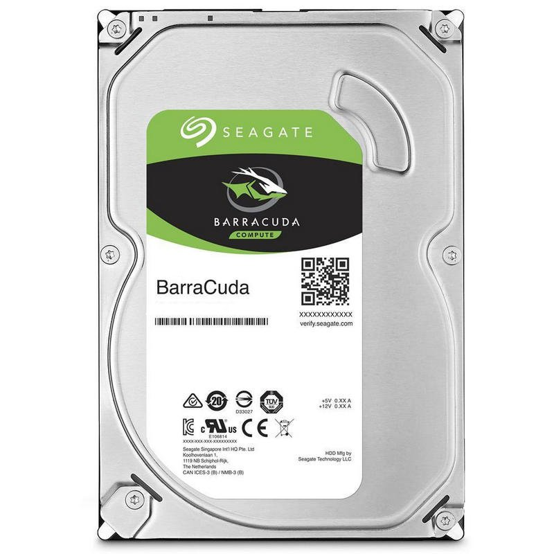       | Disc dur HDD [Seagate BarraCuda 3.5" 1TB SATA3][HDD]                  |  35,95€      |
| 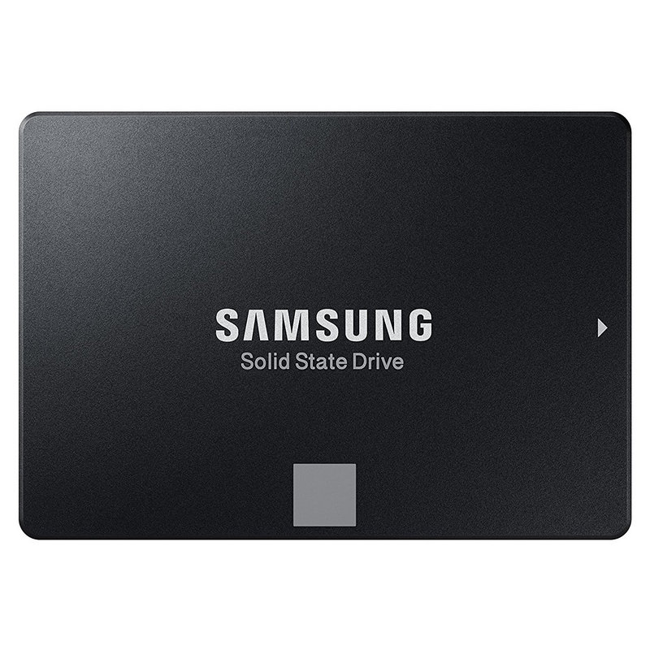       | Disc dur SSD [Samsung 860 EVO Basic SSD 250GB SATA3][SSD]             |  45,99€      |
| 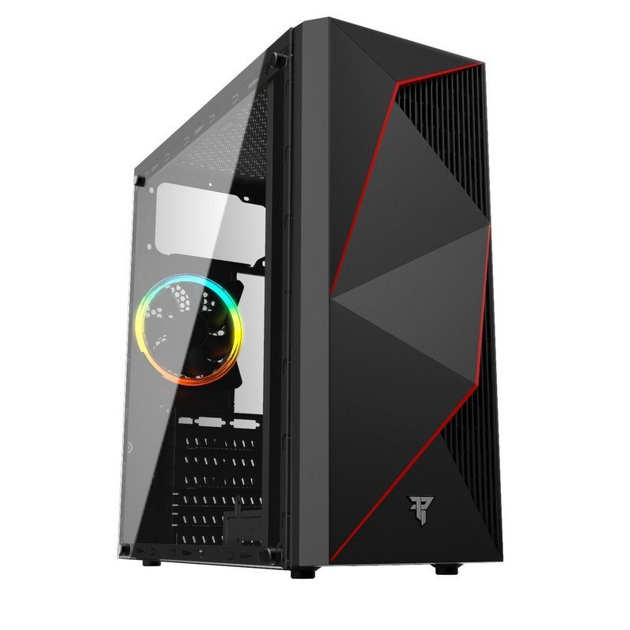                  | Torre [Tempest ATX CASE RGB Phantom USB 3.0][Torre]                   |  29,95€      |
| 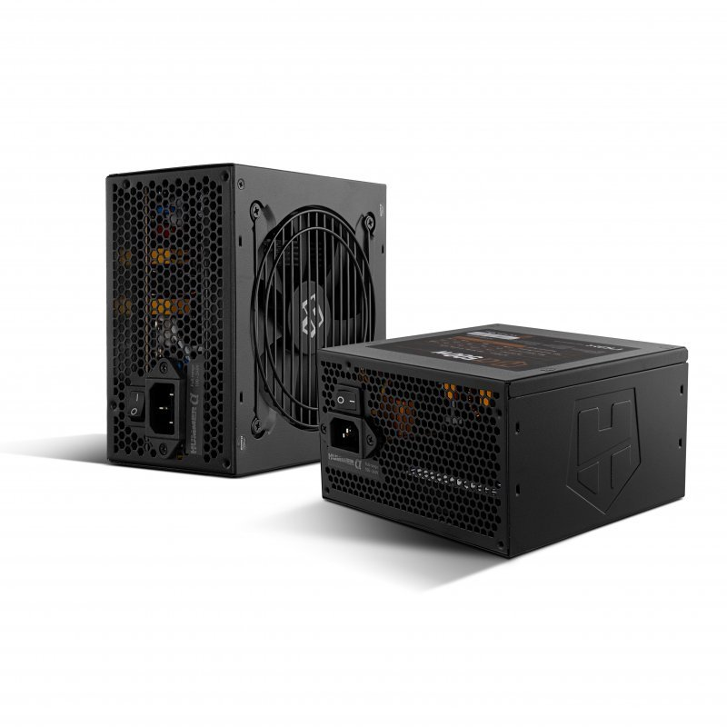    | Font d'alimentacio [NOX Hummer Alpha 500W 80 Plus Bronce][Font]       |  47,00€      |
| 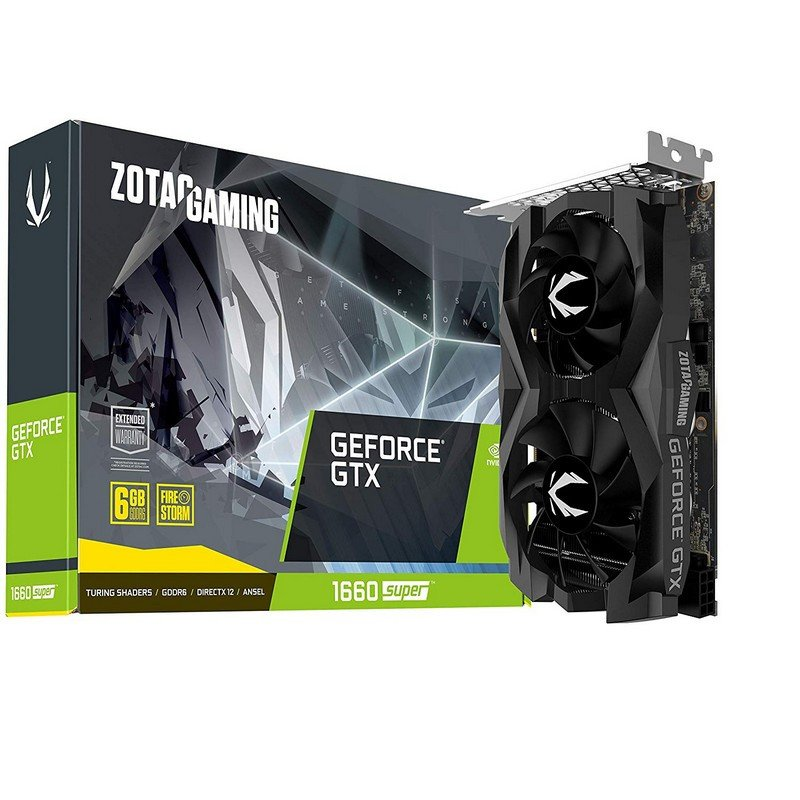                      | Targeta grafica [Zotac Gaming GTX 1660 SUPER Twin Fan 6GB GDDR6][GPU] | 239,89€      |
|                                                  |                                                                       |              |
|         TOTAL                            :       |                                                                       | 1045,56€     |

 
 

### **1.2 Periferics**

 

 #### Pantalla [Philips IPS de 24][pantalla] 99,00 €

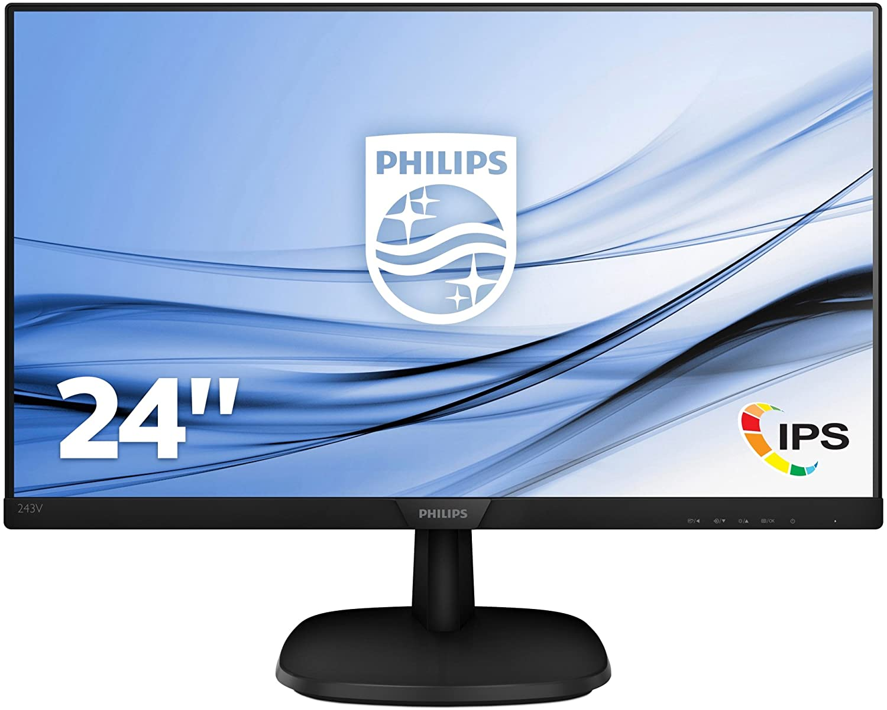

#### Tableta grafica [HUION Kamvas 20][tableta grafica] 400,99 €
 
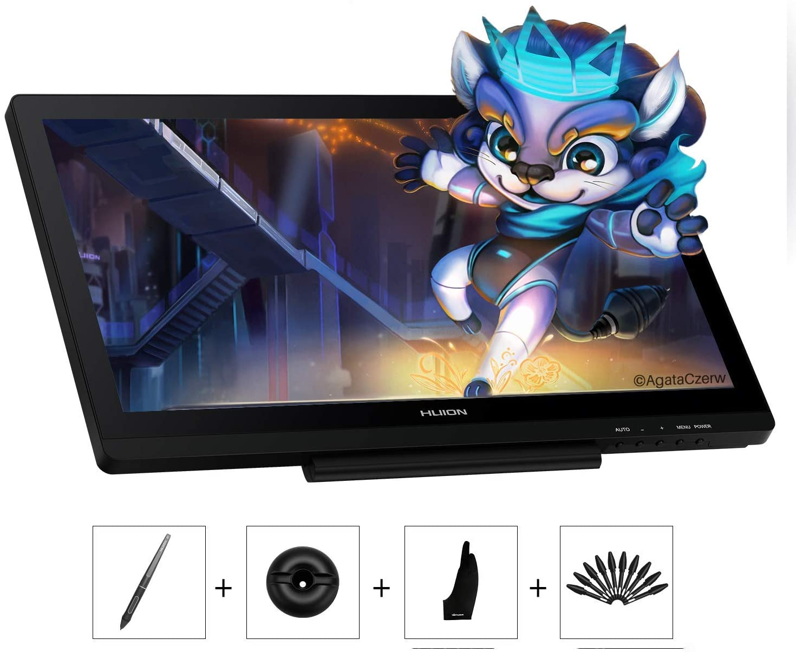

#### Teclat + ratoli [Logitech MK220][teclat ratoli] 20,90 €

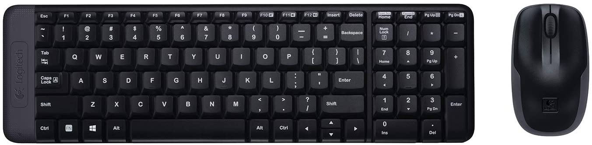

 

### **TOTAL DELS PERIFERICS : 520.89 €** 

  
 

(PRODUCTES SELECCIONATS EL 27/10/2020 )
## **2. Descripció de les característiques dels elements**
---
### 2.1 Placa base

#### Placa base de la marca MSI

- Socket LGA 1200
- Compatibilitat amb processadors Intel® Core ™ y Pentium® Gold / Celeron® de desena generació
- Admet memòria DDR4, fins a 4800 (OC) MHz
- USB ports 2x USB 3.2 Gen 2 10Gbps (1 Type-C + 1 Type-A) + 7x USB3.2 Gen 1 5Gbps (1 Type-C + 6 Type-A ) + 6x USB 2.0
- Mida ATX

### 2.2 Processador

#### Processador marca Intel

- Nombre de nuclis de processador: 8
- Nombre de filaments de processador: 16
- Freqüència base del processador 3,80 GHz
- Ús d'energia 95 W

### 2.3 Memòria RAM

#### Memòria ram marca GoodRam

- memòria ram 2x8 GB
- Tipus de memòria DDR4
- Freqüència 3000 MHz
- Suport de canal memòria Dual

### 2.4 Targeta Gràfica

#### Targeta gràfica marca NVIDIA GTX 1660 SUPER

- Memòria de 6GB 192-bit GDDR6
- Connector d'energia de 8pins
- Energia de 125W
- Sortides Three DP + HDMI
- Dimensions 283mm x 218mm x 83mm.

### 2.5 Disc dur HDD

#### Disc dur Seagate HDD 1TB

- Capacitat de 1000GB
- Velocitat de rotació de disc dur 7200RPM
- Mida disc dur: 3.5"

### 2.6 Memoria SSD
#### SSD 250GB SATA3

- Capacitat: 250 GB
- Lectura seqüencial: Fins a 550 MB / s
- Escriptura seqüencial: Fins a 520 MB / s
- Dimensions: 100 X 69.85 X 6.8 (mm)

### 2.7 Font alimentació
#### Font d'alimentació NOX Hummer Alpha 500W

- Potencia total de 500W
- Voltatge d'entrada AC: 100 - 240 MB
- Certificació 80 PLUS: 80 PLUS Bronze

### 2.8 Ventilador
#### Ventilador Cooler Master Hyper 212

- CPU Socket:
- Intel® LGA 2066/2011-v3 / 2011/1151/1150/1155/1156/1366
- AMD® AM4 / AM3 + / AM3 / AM2 + / AM2 / FM2 + / FM2 / FM1
- Connector d'alimentació de l'ventilador: 4 pins (PWM

### 2.9 Torre
#### Torre Tempest ATX CASE

- Font d'alimentació: ATX estàndard Max 160mm
- Placa base: plaques base ATX, Micro-ATX i ITX
- Mida Caixa: 390mm x 180mm x 420mm.
- HDD: 2, SSD: 2
- Posterior: Ventilador de 120mm * 1 ARGB

### 2.10 Monitor
#### Monitor Philips de 24 polsades

- Resolució pantalla: 1920 x 1080 Pixeles
- Resolució màxima: 1080p Full HD
- Dimensions: 4.5 x 54 x 32.5 cm; 3.1 kilograms

### 2.11 Teclat + ratolí
#### Teclat i ratolí Logitech

- Inalambric
- AAA (Tipus de pila n'acaçaria)
- Connectivitat a 2,6 GHz via usb receptor

### 2.12 Tauleta grafica
#### Tauleta gràfica HUION Kamvas Pro 20

- 19.5 polsades
- 16 tecles Express d'eficiència i 2 barres tàctils
- Resolució 1080P (16:9)

### 2.13 Windows 10 Home
  -Sistema operatiu 

## 3. Justificació del pressupost
### 3.1 Placa base, processador i targeta gràfica

- Hem decidit agafar aquests tres components per la seva compatibilitat entre si i per la seva eficiència. Ya que s'ajusten a les necessitats tan de rendiment (Processador i7 de 10a generació, targeta gràfica 6GB) com a preu.
### 3.2 Memòria RAM

- Es la memòria necessària per a poder treballar amb varis programes simultàniament sense preocupar-se.
### 3.3 Disc Dur i SSD
- Hem seleccionat aquests dos tipus d'emmagatzematge de memòria per una part 1 TB(HDD) per a guardar documents pesats que no calguin executar-se molt depresa, i l'altra de 250 GB(SSD) per al sistema operatiu i programes que requereixin una rapida carrega.
### 3.4 Font d'alimentació i Ventilador

- Necessitem un marge de 500W per a subministrar tot l'ordinador, amb aquesta font podrem fer-lo servir sense problemes. El ventilador l'hem seleccionat de la marca cooler master per la seva eficiència de refrigeració i sobretot al tenir un i7 de 10a generació l'hi cal algo mes que el dissipador.
### 3.5 Torre
- La torre te la suficient capacitat per a la placa base i els seus components i també perque inclou un petit ventilador posterior per a donar una millor refrigeració al interior del ordinador.
### 3.6 Monitor
- El monitor Philips de 1920x1080 de 24 polsades FHD 1080p es el que necessita per a tenir una visió dels seus projectes sense perdre resolució d'imatge.
### 3.7 Teclat i ratolí
- Hem decidit selecciona un pack inalambric perque quants menys cablejat hagi de tenir al seu escriptori millor.
### 3.8 Tauleta gràfica
- La tauleta gràfica de 19,5 polsades a una resolució de 1080P es la que necessita si vol treballar en bones condicions i sense perdre resolució.

### 3.9 Sistema operatiu Windows 10 home
- Es el sistema operatiu que te compatibilitat amb tots els programes que ha de fer servir com a arquitecte.

<!--Enlaces-->
[i7]:https://www.pccomponentes.com/intel-core-i7-9700k-36ghz

[placa]:https://www.pccomponentes.com/asus-prime-b365-plus

[Ram]:https://www.pccomponentes.com/goodram-irmd-x-ddr4-3000mhz-2x8gb-cl16

[cooler]:https://www.pccomponentes.com/cooler-master-hyper-212-black-edition

[HDD]:https://www.pccomponentes.com/seagate-barracuda-35-1tb-sata3

[SSD]:https://www.pccomponentes.com/samsung-860-evo-basic-ssd-250gb-sata3

[Torre]:https://www.pccomponentes.com/tempest-atx-case-rgb-phantom-usb-30

[Font]:https://www.pccomponentes.com/nox-hummer-alpha-500w-80-plus-bronce

[GPU]:https://www.pccomponentes.com/zotac-gaming-gtx-1660-super-twin-fan-6gb-gddr6

[pantalla]:https://www.amazon.es/Philips-243V7QDSB-00-resoluci%C3%B3n-tecnolog%C3%ADa/dp/B06Y13QBYL/ref=sr_1_2?__mk_es_ES=%C3%85M%C3%85%C5%BD%C3%95%C3%91&crid=2WJYPJ77YG04N&dchild=1&keywords=monitor%2B1080p&qid=1603827694&sprefix=monitor%2B1080%2Caps%2C185&sr=8-2&th=1

[teclat ratoli]:https://www.amazon.es/Logitech-MK220-teclado-inal%C3%A1mbrico-Espa%C3%B1ol/dp/B006LNTSP8/ref=sr_1_7?__mk_es_ES=%C3%85M%C3%85%C5%BD%C3%95%C3%91&dchild=1&keywords=teclado+y+raton&qid=1603827876&quartzVehicle=64-792&replacementKeywords=teclado+raton&sr=8-7

[tableta grafica]:https://www.amazon.es/Tableta-Gr%C3%A1fica-Pantalla-Mejorada-Inclinaci%C3%B3n/dp/B07TWL37LL/ref=sr_1_6?__mk_es_ES=%C3%85M%C3%85%C5%BD%C3%95%C3%91&dchild=1&keywords=tableta+grafica+con+pantalla+19.5+pulgadas&qid=1603988169&s=electronics&sr=1-6
