# PRESSUPOST 2 STREAMER

<link href="https://fonts.googleapis.com/css2?family=Roboto+Mono:wght@200&display=swap" rel="stylesheet">

## COMPONENTS DE LA TORRE

Què tal?

|       |         Nom         |                                     Producte                                     |                         Imatge                        |   Preu   |                            Especificacions                           |
|:-----:|:-------------------:|:--------------------------------------------------------------------------------:|:-----------------------------------------------------:|:--------:|:--------------------------------------------------------------------:|
|       |     Processador     |                    [Intel Core i7-10700K 3.80 GHz](t.ly/3T4x)                    |      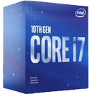      |  369.90€ |               Nuclis: 8, Filaments: 16, 3.80 GHz               |
|       |      Placa Base     |                       [MSI MPG Z490 GAMING PLUS](t.ly/pXHu)                      |        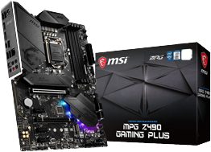       |  169.90€ | CPU Socket LGA 1200, Grafica Integrada AMD, Chipset Intel ZA90 |
|       |     Memoria RAM     | [Kingston HyperX Fury Black 16GB DDR4 3200Mhz PC-25600 2x8GB CL16](t.ly/dn4s) |          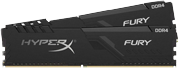          |    70€   |                  Memoria 16 GB, 3200MHz, DDR4                  |
|       |   Disc Dur Primari  |                       [Kingston A400 SSD 480GB](t.ly/8LnM)                       |           |  50,94€  |           480GB, Lectura 500MB/s, Escriptura 450 MB/s          |
|       |  Disc Dur Secundari |                  [Seagate BarraCuda 3.5" 2TB SATA 3](t.ly/jYPi)                  |    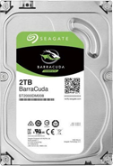   |  56,98€  |       Capacitat: 2000GB, Rotació: 7200RPM, Buffer: 256MB       |
|       |    Caixa de Torre   |                  [NOX Hummer Fusion Cristal Templado](t.ly/csxF)                 |       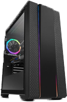      |  69,99€  |   Dimensions: 218 X 465 X 472 mm Pes: 7kg Ergonomia de Cables  |
|       | Font de alimentació |                  [Nox Hummer GD750 750W 80 Plus Gold](t.ly/m2vz)                 |  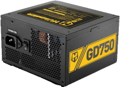 |  87,98€  |          Potencia: 750W Voltaje: 100-240V Pes: 1,73kg          |
|       |   Targeta Grafica   |              [Gigabyte GeForce RTX 2060 OC 6GB GDDR6](t.ly/nJSL)              |   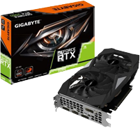  |  339.99€ |    Capacitat: 6GB Memoria: 14000 MHz Banda Memoria: 336GB/s    |
|       |  Disipador de Calor |                     [Corsair A500 Ventilador CPU](t.ly/yAnz)                     | 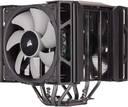 |  99,99€  |           Soroll: 36dB Velocitat: 2400RPM Pes: 1,46kg          |
|       |     Capturadora     |                             [ElGato HD60S](t.ly/seRY)                            |      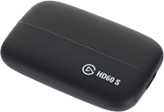     |  189,99€ |    Resolució: 1080p60 Interficie: USB 3.0 Velocitat: 60 Mbps   |
| Total |                     |                                                                                  |                                                       | 1495,56€ |                                                                      |
 

# Perque hem escollit aquest components?
Creiem que un Streamer necessita un ordinador prou potent per a suportar l'streaming i altres coses a la vegada com podria ser jocs, per tant, hem decidit que mínimament hauria de tenir un i7 per anar sense problemes. El mateix passa amb la placa base i la memòria Ram, per una part necessitem una placa base lo suficientment potent per a suportar aquesta càrrega i per altra banda necessitem que disposi d'una gran velocitat, pel que 16GB de ram no són una exageració per a res, a més hem decidit agafar dos de 8GB per reduir gastos. De cara al disc dur, hem decidit que un de 500GB estaria molt bé, però per si de cas, per assegurar-nos de què no es quedi sense espai hem agafat un segon disc dur de 2TB, perque pugui tenir tots els jocs que vulgui sense cap problema.

Com es un Streamer, també ha de tenir el seu propi FLOW, per això, creiem que una caixa per a la torre amb el vidre templat, li donarà aquest toc tan COOL que necessita, i per descomptat fins dalt de leds. També ens farà falta una targeta gràfica potent perquè pugui jugar amb tranquil·litat els jocs a la millor qualitat possible, i, tenint en compte el nostre pressupost, hem agafat aquesta. La font d'alimentació elegida a estat aquesta per raons òbvies, bàsicament necessitem suportar tots els elements anteriors. I per últim necessitarem un dissipador de calor que refrigeri tots els nostres components, com no disposem d'un gran pressupost, hem decidit conformar-nos amb un ventilador, d'haver estat el contrari, segurament hauríem tirat, de refrigeració liquida però aquesta te un gran cost de manteniment. A més a més, necessitarem una capturadora per gravar tots els jocs de consola, i creiem que la del ElGato és molt bona.

 

# PERIFERICS
 

|                                   |            Nom           |                                    Producte                                      |                       Imatge                    |   Preu  | Opcionalitat |
|:---------------------------------:|:------------------------:|:--------------------------------------------------------------------------------:|:-----------------------------------------------:|:-------:|:------------:|
|                                   |         Micròfon         |                       [Blue Yeti](https://cutt.ly/ogSaQl1)                       |     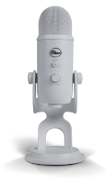       |  139.99 |      No      |
|                                   |          Webcam          |                   [Logitech StreamCam](https://cutt.ly/OgSaIWq)                  |      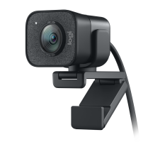          |  139.99 |      No      |
|                                   |     Monitors x2 Curva    | [MSI Optix G24C4 23.6" LED FullHD 144Hz Freesync Curva](https://cutt.ly/rgSaD3R) |  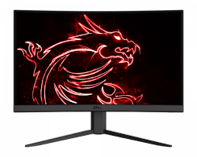     |  399.99 |      No      |
|                                   |        Focus rodó        |                      [Ring Light](https://cutt.ly/JgSaGuD)                       |    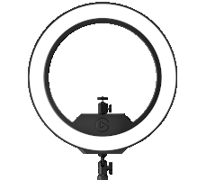     |  199.99 |      No      |
|                                   |       Green Screen       |                 [ElGato Green Screen MT](https://cutt.ly/kgFMFD4)                |   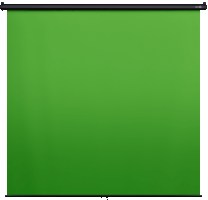  |  149.99 |      Sí      |
|                                   |        Stream Deck       |                   [ElGato Stream Deck](https://cutt.ly/WgSaBkp)                  |       |  149.99 |      Sí      |
|                                   | Espuma acústica  Pack 12 |                       [AcousPanel](https://cutt.ly/zgSaMb5)                      | 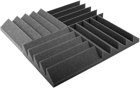      |  25.99  |      Sí      |
|                                   |      Telvisió Curva      |                [Samsung TV 49MU6655 49"](https://cutt.ly/7gSa2sA)                |  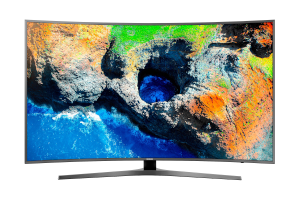   |  599.99 |      Sí      |
|    Total opcionalitat completa:   |                          |                                                                                  |                                                 | 1805.91 |              |
|     Total sense opcionalitat:     |                          |                                                                                  |                                                 |  879.96 |              |
 

# Perque hem escollit aquest periferics?
Creiem que un micròfon és essencial per a un Streamer, ja que sense ell els espectadors no el podrien escoltar, i específicament hem escollit el Blue Yeti perquè necessitem un de gran qualitat. El mateix passa amb la càmera, creiem que és crucial per al desenvolupament d'un streaming, tot i que de vegades, no fa falta, i hem escollit una webcam perquè creiem que s'adaptarà molt bé amb la resta de perifèrics. De cara als monitors, hem pensat que seran necessari mínim dos, ja que al Streamer l'interessarà veure el streaming i el xat al segon monitor per veure si tot funciona correctament mentre juga al primer, i els hem agafat uns monitors amb curvatura perquè creiem que l'ajudaran a capficar-se de ple en la seva feina. Hi ha també una petita variació a tenir dos monitors, que és la d'incorporar un televisor amb curvatura, aquesta serviria essencialment per als videojocs de consola, i també la podríem combinar amb els anteriors si no volem escatimar en gastos. A l'hora d'elegir la il·luminació pertinent, hem escollit un focus rodó per diverses raons, la primera perquè necessitem una llum artificial que ens il·lumini el rostre, la segona, perquè il·lumina tots els racons amb la mateixa intensitat, i la tercera perquè es pot variar la seva intensitat.

En el cas de la Green Screen, creiem que és bastant important tenir-ne una, per poder fusionar-nos bé en la pantalla, però no és totalment necessària, per aquesta raó l'hem posat com a opcional, tot i que no per això li hem donat menys importància, i hem acabat elegint una extensible, que es penja des del sostre, perquè així no molesta que estigui per allà terra quan està recollida. Després tenim el Stream Deck, una eina bastant important per a un Streamer, ja que li facilita moltíssim la vida de cara a petites animacions i o transicions, però sí que és cert que podem fer un streaming perfectament sense ell, pel que hem decidit posar-lo com a opcional. I per últim, tenim els panells acústics, que són aquests quadrats fets d'esponja que és col·loquen a les parets, i serveixen per insonoritzar l'habitació, doncs bé, hem elegit aquests per dues raons principals, la primera és el gruix, ja que contra més gruixos siguin més insonoritzen, i la segona les dimensions, ja que si hem de silenciar tota una paret, amb uns de molt petits ens farien falta molts, i tampoc necessitem uns enormes, perquè pot ser que no ens hi entrin bé, a més a més, hem elegit uns els quals creiem que van amb un paquet amb una quantitat bastant bona i a bon preu, i com és comprensible, aquests són totalment opcionals.
