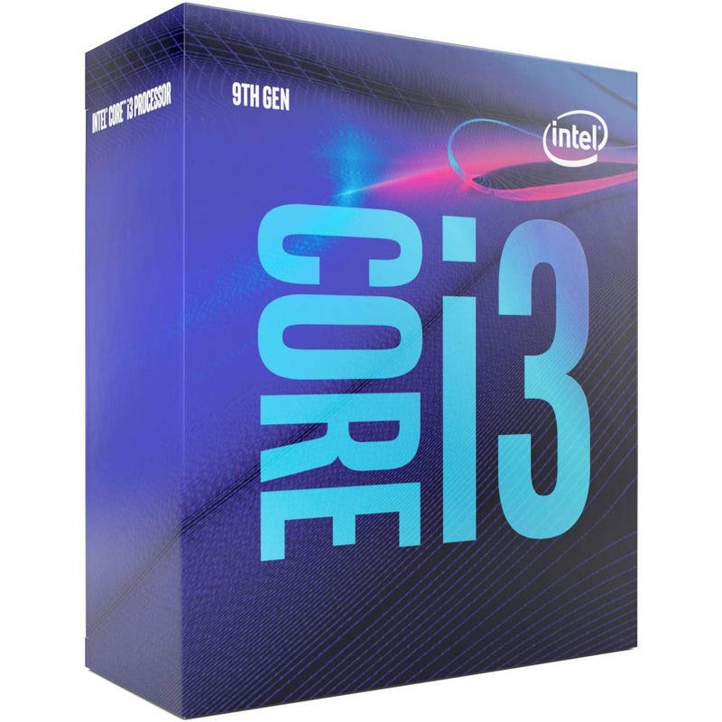
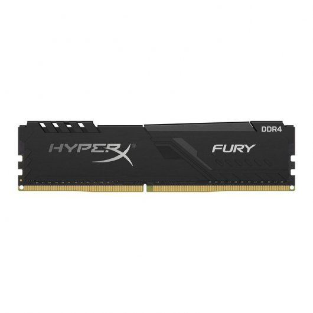
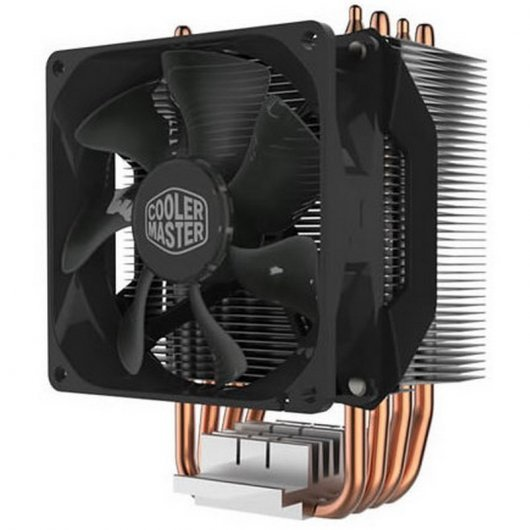
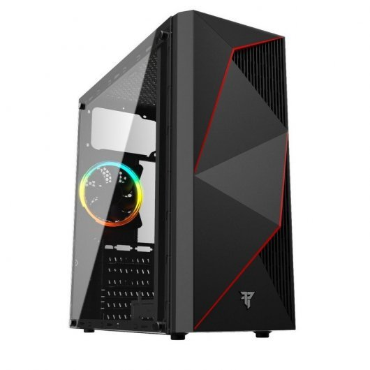
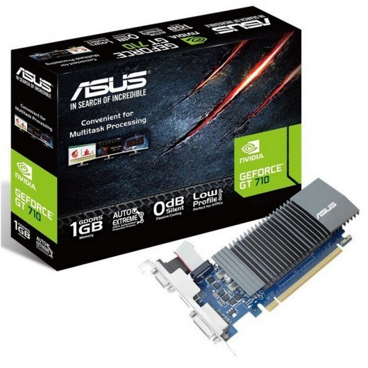
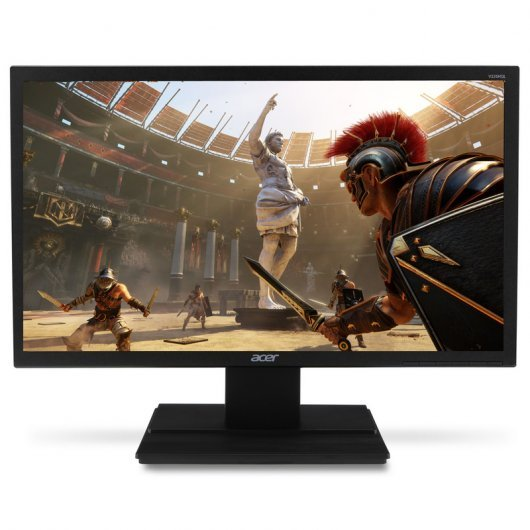

# Pressupost 3. Ordinador per a un blogger

## 1. Tria i pressupost dels elements
### 1.1 Elements de l'ordinador

| Imatge | Element | Preu | Total |
|--------|---------|------|-------|
|  | [Processador:Intel Core i3-9100 3.6 GHz](https://www.pccomponentes.com/intel-core-i3-9100-36-ghz) | 99,99€  |
|  | [PlacaBase:Gigabyte B365M-DS3H](https://www.pccomponentes.com/gigabyte-b365m-ds3h) | 75,99€  |
|  | [RAM:Kingston HyperX Fury Black 8GB DDR4 2400Mhz PC-19200 CL15](https://www.pccomponentes.com/kingston-hyperx-fury-black-8gb-ddr4-2400mhz-pc-19200-cl15) | 36€  |
|  | [Ventilador:Cooler Master Hyper H412R](https://www.pccomponentes.com/cooler-master-hyper-h412r) | 21,89€  |
|  | [Discdur:Seagate BarraCuda 3.5" 1TB SATA3](https://www.pccomponentes.com/seagate-barracuda-35-1tb-sata3) | 33,95€  |
|  | [DiscDur2:Kingston A400 SSD 240GB](https://www.pccomponentes.com/kingston-a400-ssd-240gb) | 32,48€  |
|  | [Caixa:Tempest ATX CASE RGB Phantom USB 3.0](https://www.pccomponentes.com/tempest-atx-case-rgb-phantom-usb-30) | 29,95€  |
|  | [FontAlimentacio:EVGA W1 500W 80 Plus](https://www.pccomponentes.com/evga-w1-500w-80-plus) | 44,99€  |
|  | [Gràfica:Asus GeForce GT 710 1GB GDDR5](https://www.pccomponentes.com/asus-geforce-gt-710-1gb-gddr5) | 42,53€  |
|        |           |          El preu del PC pot variar, ja que els components van canviant de preu. Aquest pressupost ha estat creat el 27/10/2020 |  Total: 422,65€    |

### 1.2 Perifèrics

| Imatge | Element | Preu | Total |
|--------|---------|------|-------|
|  | [Monitor:Acer V226HQL 21.5" LED](https://www.pccomponentes.com/acer-v226hql-215-led) | 76,99€ |       |
|  | [Tecla/Ratolí:Tempest Combo 3000 RGB Teclado + Ratón Gaming](https://www.pccomponentes.com/tempest-combo-3000-rgb-teclado-raton-gaming) | 24,99€ |       |
|       |         |  El preu dels components poden variar, ja que els components van canviant de preu. Aquest pressupost ha estat creat el 27/10/2020         | Tolal: 101,98 € |
#
## 2. Descripció de les característiques  dels elements
### 2.1 Placa Base 
Placa Base de marca Gigabyte 
<ul>
    <li>B365M-DS3H</li>
    <li>Socket de procesador: LGA 1151 (Sòcal H4)</li>
    <li>Procesador compatible: Intel® Celeron®, Intel® Core™ i3, Intel Core i5, Intel Core i7, Intel Core i9, Intel® Pentium®</li>
    <li>tipus de memòria compatibles: DDR4-SDRAM</li>
    <li>Número de ranures de memòria: 4</li>
    <li>Ethernet: Si</li>
    <li>USB 2.0, conectors: 2</li>
    <li>Connectors USB 3.0: 1</li>
    <li>Connector de potencia ATX (24 pins)</li>
    <li>Factor de forma: Micro ATX</li>
    <li>Alimentació: ATX</li>
    <li>Ranures x1 PCI Express: 1</li>
    <li>Ranures x4 PCI Express: 1</li>
    <li>Ranures x16 PCI Express: 1</li>
    <li>Número de ranures M.2 (M): 1</li>
</ul>

### 2.2 Processador
Processador marca Intel
<ul>
    <li>Model del processador: i3-9100</li>
    <li>Frecuència del procesador: 3,6 GHz</li>
    <li>Sòcal de procesador: LGA 1151 (Zócalo H4)</li>
    <li>Número de núclis de processador: 4</li>
    <li>Mode de processador operatiu: 64 bits</li>
    <li>Adaptador gràfic incorporat: Si</li>
    <li>Model d'adaptador gràfic incorporat: Intel® UHD Graphics 630</li>
</ul>

### 2.3 Ventilador de la placa
Ventilador de marca Cooler Master
<ul>
    <li>Sòcal de CPU Intel® LGA 2066 / 2011-3 / 2011/1151/1150/1155/1156/1366/775</li>
    <li>Dimensió 102 x 83,4 x 136 mm</li></ul>

### 2.4 Memòria RAM
Memòria RAM de marca Kingston
<ul>
    <li>Latencia CL15</li>
    <li>Frecuencias 2400MHz</li>
    <li>8GB</li>
    <li>DDR4</li>   
</ul>

### 2.5 HDD
<ul>
    <li>Capacidad de disco duro: 1000 GB</li>
    <li>Tamany de disco: 3.5"</li>
</ul>

### 2.6 SSD 
<ul>
    <li>Forma del disc: 2.5"</li>
    <li>Disco de estado sólido, capacidad: 240 GB</li>
</ul>

### 2.7 Caixa
<ul>
    <li>Fuente de alimentació: ATX estándar Max 160mm</li>
    <li>Placa base: Placas base ATX, Micro-ATX e ITX</li>
    <li>Bahias PCI: 7</li>
    <li>Tamany Caixa: 390mm x 180mm x 420mm.</li>
    <li>1 Ventilador de 120mm * 1 ARGB</li>
</ul>

### 2.8 Font d'alimentació
<ul>
    <li>1 x 24 PINS ATX</li>
    <li>Dimensions 85mm (H) x 150mm (W) x 140mm (L)</li>
    <li>Potencia de sortida 500W @ + 50C</li>
</ul>

### 2.9 Targeta Gràfica
<ul>
    <li>NVIDIA</li>
    <li>GeForce GT 710</li>
    <li>CUDA: Y</li>
    <li>Memoria de l'adaptador: 1GB</li>
    <li>GDDR5</li>
</ul>

### 2.10 Monitor
<ul>
    <li>Resolució de la pantalla: 1920 x 1080 píxels</li>
    <li>21.5 Polzades</li>
    <li>Temps de resposta: 5 ms</li>
    <li>Pantalla LED</li>
    <li>Full HD</li>
    <li>1 port VGA</li>
</ul>

### 2.11 Teclat i ratolí
<ul>
    <li>Sensor del ratolí ajustable a diferents DPI des de 800 a 2400.</li>
    <li>Mesures: 478x214x41mm.</li>
    <li>Iluminació en 4 colors.</li> 
    <li>Mesures: 478x214x41mm.</li>
    <li>Iluminació en 4 colors.</li>       
</ul>
    
## 3. Justificació del pressupost

