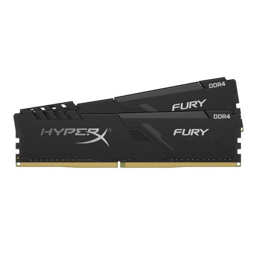
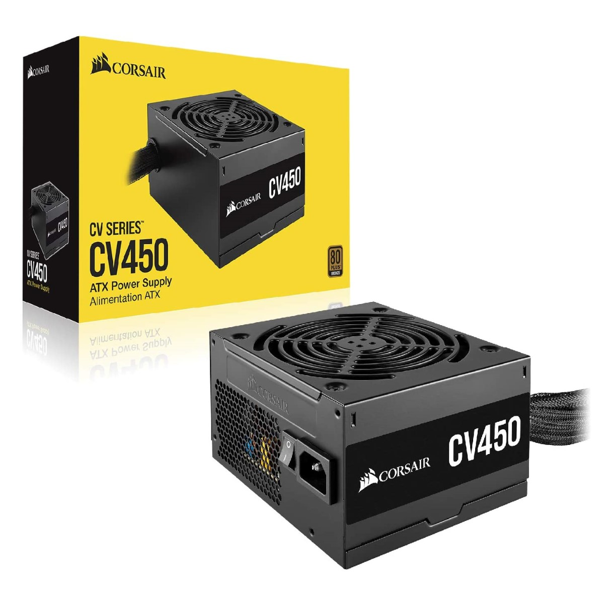
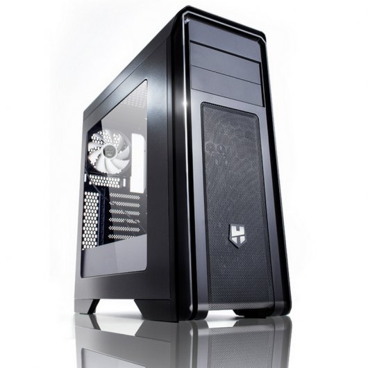
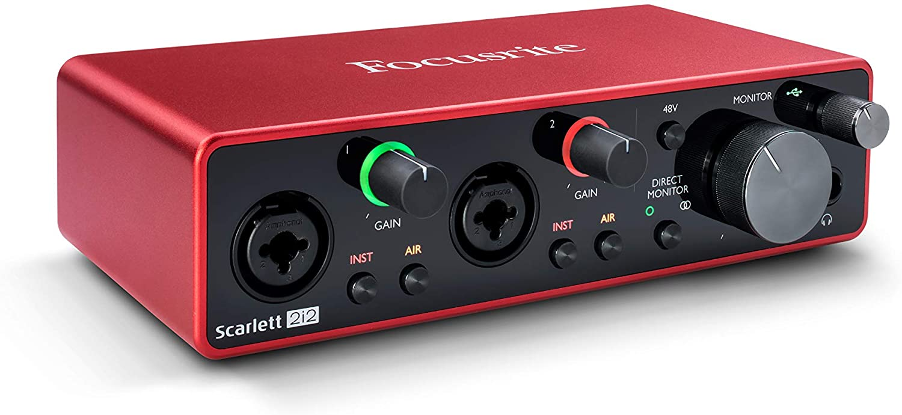
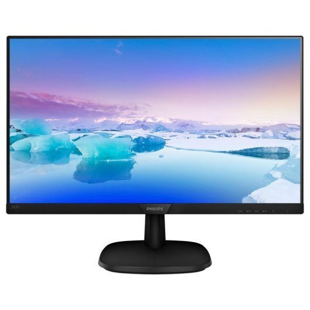
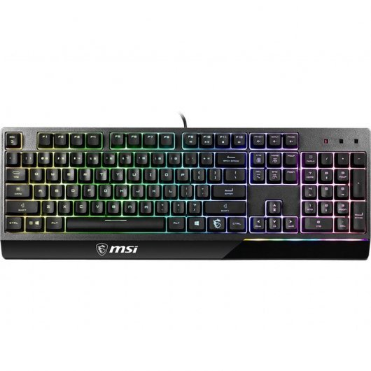
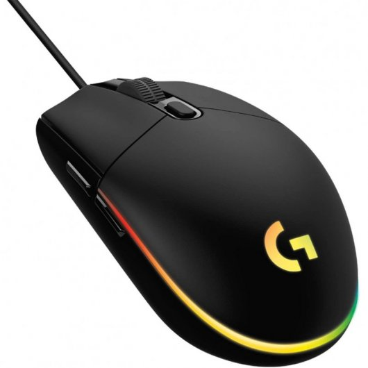

# Pressupost 4. Ordinador per un podcaster.

## 1.Tria i pressupost dels elements
### 1.1 Elements de l'ordinador
|Unitats|Imatge| Element          | Preu |
|:----:|:-----:|:----------------:|:----:| 
|1||[Placa base](https://www.pccomponentes.com/gigabyte-b450m-ds3h) |72,99€|
|1||[Processador](https://www.pccomponentes.com/amd-ryzen-5-3400g-37ghz-box)| 139,90€|
|1||[RAM](https://www.pccomponentes.com/kingston-hyperx-fury-black-16gb-ddr4-3000mhz-pc-24000-2x8gb-cl15)| 79,66€|
|1||[Disc dur](https://www.pccomponentes.com/seagate-barracuda-35-1tb-sata3)| 33,95€| 
|1||[SSD](https://www.pccomponentes.com/kingston-a400-ssd-240gb)| 33,95€|
|1||[Font d'alimentació](https://www.pccomponentes.com/corsair-cv450-cv-series-450w-80-plus-bronze)| 47,90€|
|1||[Caixa](https://www.pccomponentes.com/nox-hummer-zx-usb-30) | 45,50€ | 
|1||[Targeta de so](https://www.amazon.es/Focusrite-AMS-SCARLETT-2I2-3G-Scarlett-2i2-3rd/dp/B07QR73T66)| 142,00€|
|Total:|||595,88€|
---

### 1.2Perifèrics
|Unitats|Imatge| Element          | Preu |
|:----:|:-----:|:----------------:|:----:|
|2||[Micròfon](https://www.thomann.de/es/rode_nt1a_complete_vocal_recording.htm )|175,00€ |
|1||[Pantalla]([img/](https://www.pccomponentes.com/philips-243v7qdsb-238-led-ips-fullhd))| 99,99€ |
|1||[Teclat](https://www.pccomponentes.com/msi-vigor-gk30-teclado-gaming-rgb)|59,99€|
|1||[Ratolí](https://www.pccomponentes.com/logitech-g203-lightsync-2nd-gen-raton-gaming-8000dpi-rgb-negro)| 28,99€ |
|Total:|||363,99€|

## 2. Descripció de la tria dels elements

### 2.1 Placa base
Placa base de la marca Gigabyte model b450 ds3h amb les característiques tècniques següents:
- Socket AM4
- Chipset AMD B450
- Processadors cmpatibles: Ryzen 3, Ryzen 5, Ryzen 7 i Ryzen 9 que tingun el socket AM4

### 2.2 Processador
Processador de la marca AMD model Ryzen 5 amb les característiques tècniques següents:
- Número de nuclis: 4
- Fils: 8
- Freqüencia: 3.7GHz

### 2.3 Memòria RAM
Memòries RAM de la marca HyperX (Kingston) model Fury Black amb les característiques tècniques següents:
- Capacitat: 16GB
- Frequència: 3000MHz
- Latències CL16

### 2.4 Font d'alimentació
Font d'alimentació de la marca Corsair model CV450 80 Plus Bronze amb les característiques tècniques següents:
- Potencia total: 450W
- Frecuencia d'entrada AC:47-63 Hz
- Corrent d'entrada: 10-5 A 

### 2.5 Disc SSD
Disc SSD de la marca Kingston model A400 amb les característiques tècniques següents:
- Capacitat: 240GB
- Factor de forma: 2.5 Polzades
- Velocitat de lectura: 500 MB/s
- Velocitat d'escritura: 350 MB/s 

### 2.6 Disc dur
Disc dur de la marca Seagat model BarraCuda 3.5 amb les característiques tècniques següents:
- Capacitat: 1000GB
- Velocitat: de rotació: 7200RPM
- Unitat, tamany del bufer: 64MB

### 2.7 Caixa
Caixa de la marca Nox model ZX amb les característiques tècniques següents:
- Ports
- 2xUSB 3.0
  - 2X USB 2.0
  - HD audio; Micròfon
- Sistema de ventilació
  - Ventiladors frontals 2x 120mm (inclosos)
  - Ventilador del darrere 1x 120mm  (inclòs)
  - Ventiladors superiors 2x 120mm (no inclosos)  
- Badies
  - Externes: 2x 5.25 polzades
  - Internes 2x 3.5; 3x 2.5 polzades
- Ranures d'expansió 7

### 2.8 Targeta de so
Targeta de so de la marca Focusrite model Scarlett 2i2 amb les característiques tècniques següents:
- 2 entrades de micròfon
- Funció Air conmutable
- 24 Bit/ 192kHz

### 2.9 Pantalla
Pantalla marca Philips model 243V7QDSB amb les característiques tècniques següents:
- Pulgades: 23.8
- Resolució de pantalla: 1920x1080 Pixels
- Temps de resposta: 5ms
- Full HD

### 2.11 Micròfon
Micròfon de la marca Rode model NT1-A amb les característiques tècniques següents:
- Micròfon de Membrana gran amb diafragma de 1 polzada
- Patró polar: Cardioide
- Rang de frequència: 20Hz - kHz
- SLP màxim: 137 dB
- Impedància de sortida: 100 Ohm 

### 2.12 Ratolí
Ratolí marca Logitech model G203 amb les característiques tècniques següents:
- 8000DPI
- Velocitat de resposta: 1.000Hz (1ms)

### 2.13 Teclat
Teclat marca MSI model Vigor GK30 amb les característiques tècniques següents:
- Teclat numèric: Si
- Idioma del teclat: Espanyol
- Tecles d'accés directe: Si

## 3. Justificació del pressupost
PLACA BASE | 

    Hem decidit comprar aquesta placa base deugut al preu de la mateixa i com no necessitem una targeta grafica no feie falta una placa base millor.

PROCESSADOR |

    La nostra decisio a l'hora de escollir la cpu es va enfocar principalment en la calitat/preu del producte, també la decisió de no disposar de una tarjeta grafica va fer que optesim per aquet debut a que nomes la serie "G" dels procesadors ryzen tenen grafica integrada. Vam escollir el model ryzen 5 3400G perque dispose de la millor tarjeta grafica integrada que hi ha actualment en el mercat.

RAM | 

    Hem decidit escollir aquesta memòria ram degut a que com que es un  dels models de 16Gb més barats, és d'una marca tant reconeguda com Kingston, i com que es una de les opcions més recomenades per la gent, fos una de les millors opcions a escollir.

DISC DUR | 

Ens hem decidit per aquest disc dur per la calitat preu que disposa, degut al preu que té i la capacitat d'emmagatzematge que disposa, es la millor opció a escollir entre els diferents discs durs de les mateixes prestacions e.
    
    

SSD | 

    

FONT D'ALIMENTACIÓ | 

CAIXA | 

TARGETA DE SO |

MICRÒFON | 

PANTALLA |

  