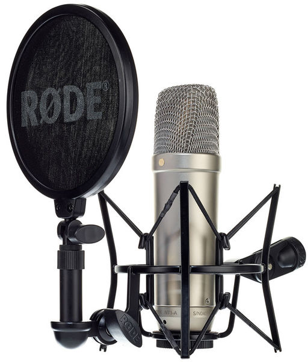

# Pressupost 4. Ordinador per un podcaster.

## 1.Tria i pressupost dels elements
### 1.1 Elements de l'ordinador
|Unitats|Imatge| Element          | Preu |
|:----:|:-----:|:----------------:|:----:| 
|1||[Placa base](https://www.pccomponentes.com/gigabyte-b450m-ds3h) |72,99€|
|1||[Processador](https://www.pccomponentes.com/amd-ryzen-5-3400g-37ghz-box)| 139,90€|
|1||[RAM](https://www.pccomponentes.com/kingston-hyperx-fury-black-16gb-ddr4-3000mhz-pc-24000-2x8gb-cl15)| 79,66€|
|1||[Disc dur](https://www.pccomponentes.com/seagate-barracuda-35-1tb-sata3)| 33,95€| 
|1||[SSD](https://www.pccomponentes.com/kingston-a400-ssd-240gb)| 33,95€|
|1||[Font d'alimentació](https://www.pccomponentes.com/corsair-cv450-cv-series-450w-80-plus-bronze)| 47,90€|
|1||[Caixa](https://www.pccomponentes.com/nox-hummer-zx-usb-30) | 45,50€ | 
|1||[Targeta de so](https://www.amazon.es/Focusrite-AMS-SCARLETT-2I2-3G-Scarlett-2i2-3rd/dp/B07QR73T66)| 142,00€|
|Total:|||595,85€|
---

### 1.2Perifèrics
|Unitats|Imatge| Element          | Preu |
|:----:|:-----:|:----------------:|:----:|
|2||[Micròfon](https://www.thomann.de/es/rode_nt1a_complete_vocal_recording.htm )|175,00€ |
|2||[Auriculars](https://es-fusionelectronix.glopalstore.com/skullcandy-grind-bluetooth-headphones-in-black-chrome/?sku=583129)|47,77€|
|1||[Pantalla](https://www.pccomponentes.com/philips-243v7qdsb-238-led-ips-fullhd)| 99,99€ |
|1||[Teclat](https://www.pccomponentes.com/msi-vigor-gk30-teclado-gaming-rgb)|59,99€|
|1||[Ratolí](https://www.pccomponentes.com/logitech-g203-lightsync-2nd-gen-raton-gaming-8000dpi-rgb-negro)| 28,99€ |
|Total:|||634,51€|

## 2. Descripció de la tria dels elements

### 2.1 Placa base
---
Placa base de la marca Gigabyte model b450 ds3h amb les característiques tècniques següents:
- Socket AM4
- Chipset AMD B450
- Processadors cmpatibles: Ryzen 3, Ryzen 5, Ryzen 7 i Ryzen 9 que tingun el socket AM4

### 2.2 Processador
Processador de la marca AMD model Ryzen 5 amb les característiques tècniques següents:
- Número de nuclis: 4
- Fils: 8
- Freqüencia: 3.7GHz

### 2.3 Memòria RAM
Memòries RAM de la marca HyperX (Kingston) model Fury Black amb les característiques tècniques següents:
- Capacitat: 16GB
- Frequència: 3000MHz
- Latències CL16

### 2.4 Font d'alimentació
Font d'alimentació de la marca Corsair model CV450 80 Plus Bronze amb les característiques tècniques següents:
- Potencia total: 450W
- Frecuencia d'entrada AC:47-63 Hz
- Corrent d'entrada: 10-5 A 

### 2.5 Disc SSD
Disc SSD de la marca Kingston model A400 amb les característiques tècniques següents:
- Capacitat: 240GB
- Factor de forma: 2.5 Polzades
- Velocitat de lectura: 500 MB/s
- Velocitat d'escritura: 350 MB/s 

### 2.6 Disc dur
Disc dur de la marca Seagat model BarraCuda 3.5 amb les característiques tècniques següents:
- Capacitat: 1000GB
- Velocitat: de rotació: 7200RPM
- Unitat, tamany del bufer: 64MB

### 2.7 Caixa
Caixa de la marca Nox model ZX amb les característiques tècniques següents:
- Ports
- 2xUSB 3.0
  - 2X USB 2.0
  - HD audio; Micròfon
- Sistema de ventilació
  - Ventiladors frontals 2x 120mm (inclosos)
  - Ventilador del darrere 1x 120mm  (inclòs)
  - Ventiladors superiors 2x 120mm (no inclosos)  
- Badies
  - Externes: 2x 5.25 polzades
  - Internes 2x 3.5; 3x 2.5 polzades
- Ranures d'expansió 7

### 2.8 Targeta de so
Targeta de so de la marca Focusrite model Scarlett 2i2 amb les característiques tècniques següents:
- 2 entrades de micròfon
- Funció Air conmutable
- 24 Bit/ 192kHz

### 2.9 Pantalla
Pantalla marca Philips model 243V7QDSB amb les característiques tècniques següents:
- Pulgades: 23.8
- Resolució de pantalla: 1920x1080 Pixels
- Temps de resposta: 5ms
- Full HD

### 2.11 Micròfon
Micròfon de la marca Rode model NT1-A amb les característiques tècniques següents:
- Micròfon de Membrana gran amb diafragma de 1 polzada
- Patró polar: Cardioide
- Rang de frequència: 20Hz - kHz
- SLP màxim: 137 dB
- Impedància de sortida: 100 Ohm 

### 2.12 Ratolí
Ratolí marca Logitech model G203 amb les característiques tècniques següents:
- 8000DPI
- Velocitat de resposta: 1.000Hz (1ms)

### 2.13 Teclat
Teclat marca MSI model Vigor GK30 amb les característiques tècniques següents:
- Teclat numèric: Si
- Idioma del teclat: Espanyol
- Tecles d'accés directe: Si

### 2.14 Auriculars
Auriculars marca Skullcandy model grind  amb les característiques tècniques següents:
- Connexió Bluetooth
- Pes 168 g
- Dimensions 17.8 x  9.1 x 20.3 cm

## 3. Justificació del pressupost
PLACA BASE | 

Hem decidit comprar aquesta placa base deugut al preu de la mateixa, al no haver-ne de fer un ús exhaustiu hem pensat que aquesta cobria perfectament les nostres necessitats.

PROCESSADOR  

  A l'hora de escollir la CPU ens vam enfocar principalment en la relació calitat/preu del producte, també la decisió de no disposar d'una targeta gràfica va fer que optessim per aquesta degut a que nomes la serie "G" dels procesadors Ryzen tenen gràfica integrada. Vam escollir el model Ryzen 5 3400G perque disposa de la millor targeta gràfica integrada que hi ha actualment al mercat. Tamber dir que aquest processador és suficientment potent per a poder realitzar un podcast sense tenir cap tipus de problema.

RAM  

  Hem escollit una memòria RAM de 16GB, aquesta quantitat és suficient com per a que l'ordinador no tingui cap problema a l'hora d'utilitzar més d'un software a la vegada. La memòria conta amb dos mòduls de 8GB cadascún y de 3000Mhz amb una latència de cl16. Ser d'una marca tant reconeguda com Kingston, fa que sigui una de les més recomanades, fet que ha propiciat que ens decanstèssim per aquesta.

DISC DUR 

Hem escollit aquest disc dur per la relació calitat/preu de la qual disposa. La seva capacitat d'emmagatzematge la converteix amb la millor opció a escollir entre els diferents discs durs de les mateixes prestacions.
    
    

SSD 

El disc dur SSD és algo que es necessari per a la velocitat a l'hora de carregar tant el S.O. com els programes. 
La diferència de velocitat entre un disc dur SSD y un HDD és molt significativa, hem escollit un SSD de 240GB, ja que hi ha suficient espai com per a que el sistema operatiu y els altres softwares estiguin emmagatzemats dins. Hem decidit escollir aquesta memoria SSD perquè dels models de 240Gb era la que tenia el preu més competitiu i és una de les marques més recomanades.
    

FONT D'ALIMENTACIÓ 

Hem decidit escollir aquesta font d'alimentació perquè al ser d'una marca tant confiable com ho es Corsair i, donat que l'equip no necessita una cantitat de Watts molt elevada, la converteix en una gran opció a escollir per aquest equip.

CAIXA 

Amb la caixa no ens hem complicat masa, es una caixa normal amb un espai bastant gran, per si en un futur es volgués ficar una targeta gràfica, ficar més discs durs o un lector de cd. Realment no es tan important l'espai degut a que l'ordinador no disposa de targeta gràfica ni de refrigeració líquida, per tant, no necessita molt espai. Aquesta caixa ens ha convençut per el seu preu. 

TARGETA DE SO 

Hem decidit agafar aquesta targeta de so perquè és un element molt important per a un podcaster. A més és una marca molt recomanada, i el preu és molt assequible per la qualitat de la targeta.

MICRÒFON  

Ens vam decantar per aquest micròfon per vàries raons.
La primera és que, per dur a terme la tasca de podcaster és essencial, a nivell perifèrics, contar amb un bon micròfon.
Hem decidit escollir aquest micròfon perquè és un dels millors del mercat al seu rang de preu, també perquè al ser un equip pensat per a un podcast, el més important és la veu de l'entrevistador i l'entrevistat i, al ser un micròfon Cardioide, capta molt bé les veus que estiguin davant del micròfon.

AURICULARS 

 

Ens hem decantat per aquests auriculars perquè per la calitat de so que ofereixen i la insonorització es més que suficient pel seu preu.

PANTALLA 

Hem decidit escollir aquesta pantalla perquè no necessitem una gran qualitat i el preu és bastant assequible, a més a més la marca Philips la converteix en un producte de confiança.

TECLAT 

Hem escollit aquest teclat perquè voliem un teclat que ens donés de bona calitat i a un preu que no passés el pressupost.

RATOLÍ 

Per al ratolí hem decidit aquest perquè no és un element massa important per a un podcaster i aquest model té una relació qualitat/preu molt bona.